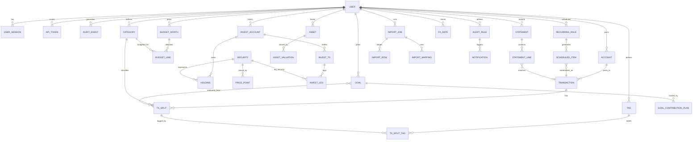
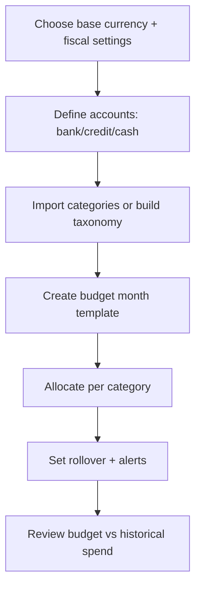
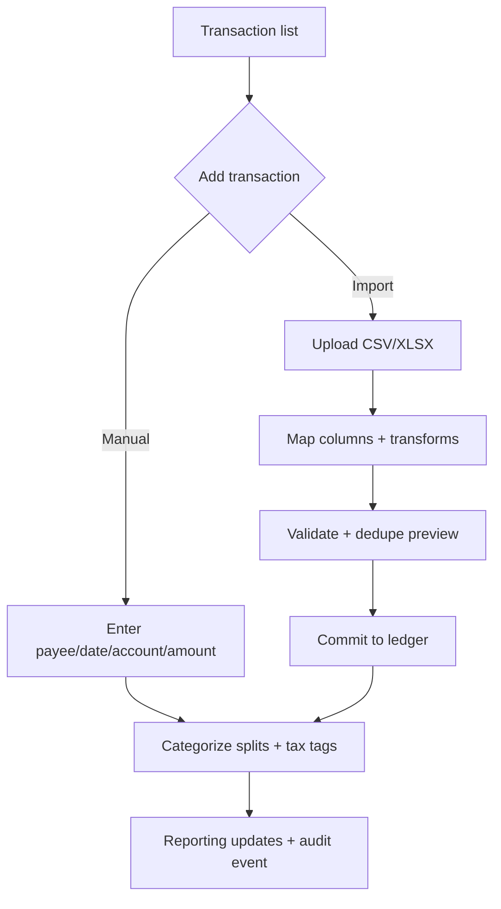
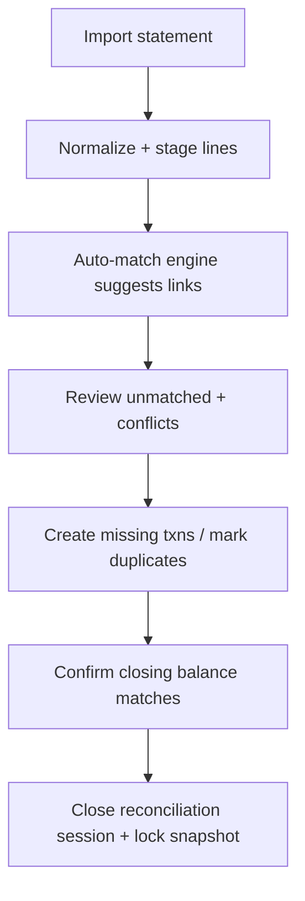
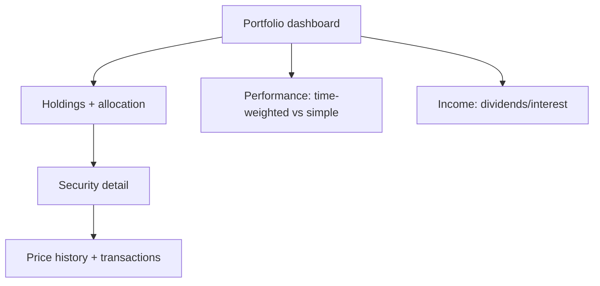
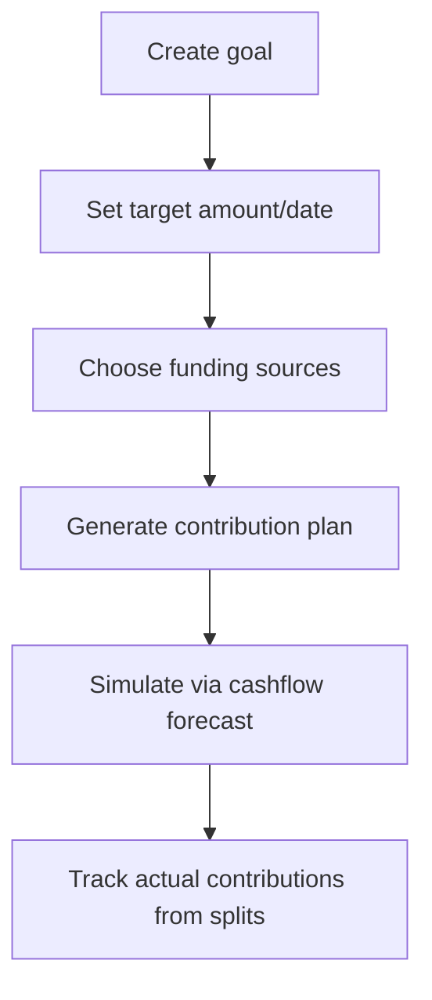
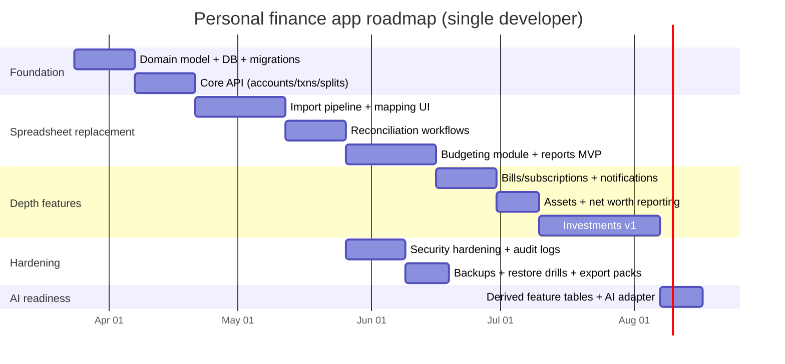

# Designing a Single-User Personal Finance Application for Spreadsheet Consolidation

## Executive summary

A robust, spreadsheet-replacing personal finance app for a single user is best designed as a **local-first, ledger-centered system** with a clean UI, strong import/reconciliation tooling, and a privacy-by-design security posture. The architecture that most reliably delivers correctness (net worth, reconciliation, forecasting, tax tagging) while still being implementable solo is:

- A **canonical ledger domain model** (accounts → transactions → splits/postings) that treats budgeting, tax tracking, goals, and reporting as *views over the same normalized data*.  
- A **staged import pipeline** (raw ingest → mapping → validation → idempotent commit), grounded in CSV norms and deterministic transformations (with a rules/mapping UI). citeturn5search0  
- A **modular API surface** described via OpenAPI so you can use Codex to generate scaffolding, clients, and tests while keeping the domain model authoritative. citeturn3search5  
- A security baseline aligned to modern best-practice references (OWASP ASVS + OWASP Cheat Sheets + NIST crypto/auth guidance), paired with GDPR-like privacy controls (export, delete, defaults-minimal). citeturn0search12turn1search2turn0search2turn6search3turn8search2  

Two viable implementation shapes emerge:

- **Local-first desktop** (SQLite + encrypted storage + background jobs) for maximum privacy and fastest delivery of spreadsheet consolidation; optional minimal local HTTP API for extensibility. citeturn10search5turn2search3turn1search2  
- **Single-user self-hosted web** (PostgreSQL + backend API + web UI) if you want multi-device access and a clearer path to future integrations (e.g., OFX/Open Banking). citeturn10search8turn2search2turn5search10  

A realistic solo roadmap is **12–16 weeks to a high-quality MVP** (transactions, budgets, import+mapping, reconciliation, dashboards, backups) and **20–28 weeks** to reach “planner-grade” depth (investments with performance, cashflow forecasting scenarios, richer tax workflows, alert rules, AI-ready semantic layer). (Estimates in the final section.)

## Product scope and core features

This section frames each required feature as a **domain capability**, a **minimum viable implementation**, and an **upgrade path**. The intent is to keep everything implementable while preserving rigor and long-term extensibility.

**Monthly budgeting (envelopes + category plans)**  
Start with **category-month allocations** and rollovers: budget lines keyed by `{month, category, currency}` plus optional rollover policy. Treat “budget” as a plan layer; actuals come from categorized transaction splits. This separation preserves accounting correctness while enabling flexible UX (envelope, zero-based, or hybrid models). (Design rationale; normalization best practice is implicit in the ledger approach and aligns with auditability goals from security logging guidance.) citeturn1search0

**Expense tracking (transactions + splits + categorization)**  
Model every cash transaction as an immutable-ish record with editable fields; categorization happens in **splits** so a single purchase can map to multiple categories/tax treatments/goals. This is foundational for clean import/reconciliation and accurate reporting.

**Asset & investment tracking (holdings + valuations + performance)**  
Support two tiers:
- Tier 1: **manual assets** (property, vehicle, private business) with valuation history.
- Tier 2: **investment accounts** with holdings, trades, corporate actions (optional), price history, and performance metrics.  
Use ISO currency codes for all monetary values and store price/quantity with decimal logic to avoid floating-point surprises. citeturn2search0turn9search0turn9search2  

**Net worth**  
Compute as:  
`Σ(asset account balances + asset valuations + investment market value) − Σ(liability balances)`  
and convert to a user-selected base currency using stored FX rates. ISO currency codes reduce ambiguity across imports. citeturn2search0  

**Cashflow forecasting**  
A rigorous yet implementable approach is:  
- deterministic **scheduled cashflows** (bills, subscriptions, planned transfers, goal contributions), plus  
- optional statistical projections (seasonality, average burn) kept behind a “scenario” layer to avoid contaminating audited actuals.  
This separation mirrors general continuity/contingency planning discipline: keep core records stable; simulate in overlays. citeturn4search1turn11search0  

**Bills & subscriptions**  
Model as recurring templates with next-run calculation and “generated instances” linked to eventual real transactions (for reconciliation). Alerts triggered for upcoming due dates and atypical increases.

**Tax tracking**  
Keep it pragmatic and future-proof:
- tax tags per split (e.g., deductible category, VAT flag, capital gains bucket),
- tax-year attribution rules (cash vs accrual-like handling for specific workflows),
- attachments (receipts) with hash + metadata for audit trail integrity.  
GDPR-like “data minimization” and “storage limitation” principles help keep attachments controlled and purposeful. citeturn6search3  

**Goals**  
Define goals with contribution schedules and optional investment allocation targets (e.g., emergency fund, house deposit). Goals should consume actuals from transactions and scheduled forecasts, not from manual progress edits.

**Multi-currency**  
Use:
- ISO 4217 codes for every monetary value, citeturn2search0  
- ISO 8601 timestamps/dates for imports/events, citeturn2search1  
- explicit FX rate sources and effective dates to ensure reproducibility of historical reporting.

**Account reconciliation**  
Treat reconciliation as a first-class workflow: imported statement lines matched (or linked) to internal transactions, with a reconciliation session capturing opening/closing balances and exceptions. This is critical when migrating from spreadsheets where “truth” may be distributed.

**Import/export of spreadsheets/CSV**  
Adopt a pipeline based on RFC 4180-informed ingestion (header handling, quoting, line breaks), then map into your canonical model with deterministic transforms and clear error reporting. citeturn5search0  

**Reporting & visualizations**  
Base reporting on reusable query primitives (time series, category aggregations, cohort/merchant analysis, asset allocation). Follow established data visualization interaction and accessibility principles (progressive disclosure, tooltips, accessible markup). citeturn5search3turn3search0turn5search11  

**Alerts/notifications**  
Implement rule-driven notifications (bill due, overspend, low balance, unusual spend). Rate-limit notifications and store a notification audit log for explainability.

**Security/privacy, backups, audit logs**  
Use OWASP ASVS as a requirements backbone (it is explicitly intended as a basis for verifying security controls). citeturn7search3turn0search12  
Combine that with focused OWASP cheat sheets on password storage, cryptographic storage, session management, logging, secrets, and database security. citeturn0search1turn1search2turn8search0turn1search0turn10search6turn10search10  

**Extensibility for future AI**  
Design for AI without prematurely coupling:
- stable identifiers, clean domain events, consistent taxonomy for categories/tags,
- a feature store-like derived table layer (monthly aggregates, merchant vectors),
- strict privacy controls and explicit opt-in when sending data to external model APIs, consistent with trustworthy AI guidance emphasizing privacy-enhancement and transparency. citeturn11search0turn11search7  

## Modular data model and persistence

The following model is intentionally **modular**, so you can implement core ledger + import + reconciliation first, then add investments, goals, forecasting, alerts, and AI layers without schema rewrites. Currency and time standards are explicit to prevent cross-spreadsheet ambiguity. citeturn2search0turn2search1turn5search0  

### ER diagram (Mermaid)



### Canonical database schema (PostgreSQL-oriented)

The schema below uses **exact numeric/decimal storage** where precision matters and avoids binary floating-point for money. PostgreSQL’s numeric types and JSONB support are documented features, and row-level security is available if you ever expand beyond strictly single-user assumptions. citeturn9search0turn9search4turn2search2turn2search6  

Key conventions:
- Monetary amounts stored as `amount_minor BIGINT` + `currency_code CHAR(3)` (ISO 4217). citeturn2search0  
- Dates as `DATE` for posting date; timestamps as `TIMESTAMPTZ` in ISO-8601-compatible formats. citeturn2search1  
- Audit diffs stored as `JSONB` snapshots (before/after) for traceability. citeturn9search4turn1search0  

```sql
-- Core identity
CREATE TABLE app_user (
  user_id UUID PRIMARY KEY,
  email TEXT UNIQUE,
  display_name TEXT,
  base_currency CHAR(3) NOT NULL,
  created_at TIMESTAMPTZ NOT NULL DEFAULT now()
);

CREATE TABLE user_session (
  session_id UUID PRIMARY KEY,
  user_id UUID NOT NULL REFERENCES app_user(user_id),
  session_token_hash BYTEA NOT NULL,
  created_at TIMESTAMPTZ NOT NULL DEFAULT now(),
  last_seen_at TIMESTAMPTZ NOT NULL DEFAULT now(),
  expires_at TIMESTAMPTZ NOT NULL,
  revoked_at TIMESTAMPTZ
);

-- Accounts and categorization
CREATE TABLE account (
  account_id UUID PRIMARY KEY,
  user_id UUID NOT NULL REFERENCES app_user(user_id),
  name TEXT NOT NULL,
  account_type TEXT NOT NULL, -- checking|savings|credit|cash|loan|brokerage_cash|...
  currency_code CHAR(3) NOT NULL,
  institution TEXT,
  external_ref TEXT,
  is_closed BOOLEAN NOT NULL DEFAULT false,
  created_at TIMESTAMPTZ NOT NULL DEFAULT now()
);

CREATE TABLE category (
  category_id UUID PRIMARY KEY,
  user_id UUID NOT NULL REFERENCES app_user(user_id),
  name TEXT NOT NULL,
  parent_category_id UUID REFERENCES category(category_id),
  default_tax_tag TEXT,
  is_active BOOLEAN NOT NULL DEFAULT true
);

CREATE TABLE tag (
  tag_id UUID PRIMARY KEY,
  user_id UUID NOT NULL REFERENCES app_user(user_id),
  name TEXT NOT NULL UNIQUE
);

-- Transactions
CREATE TABLE txn (
  txn_id UUID PRIMARY KEY,
  user_id UUID NOT NULL REFERENCES app_user(user_id),
  account_id UUID NOT NULL REFERENCES account(account_id),
  posted_date DATE NOT NULL,
  description TEXT,
  payee TEXT,
  memo TEXT,
  amount_minor BIGINT NOT NULL,        -- signed; in account currency
  currency_code CHAR(3) NOT NULL,
  txn_type TEXT NOT NULL,              -- expense|income|transfer|fee|adjustment
  status TEXT NOT NULL DEFAULT 'posted', -- pending|posted|void
  import_fingerprint TEXT,             -- idempotency / dedupe key
  created_at TIMESTAMPTZ NOT NULL DEFAULT now(),
  updated_at TIMESTAMPTZ NOT NULL DEFAULT now()
);

CREATE INDEX idx_txn_user_date ON txn(user_id, posted_date);
CREATE INDEX idx_txn_account_date ON txn(account_id, posted_date);
CREATE UNIQUE INDEX ux_txn_import_fingerprint ON txn(user_id, import_fingerprint) WHERE import_fingerprint IS NOT NULL;

CREATE TABLE tx_split (
  split_id UUID PRIMARY KEY,
  txn_id UUID NOT NULL REFERENCES txn(txn_id) ON DELETE CASCADE,
  category_id UUID REFERENCES category(category_id),
  amount_minor BIGINT NOT NULL,     -- signed; sum(splits) = txn.amount_minor
  tax_tag TEXT,                     -- e.g., deductible|capital_gains|vat_input
  note TEXT
);

CREATE INDEX idx_split_txn ON tx_split(txn_id);

CREATE TABLE tx_split_tag (
  split_id UUID NOT NULL REFERENCES tx_split(split_id) ON DELETE CASCADE,
  tag_id UUID NOT NULL REFERENCES tag(tag_id) ON DELETE CASCADE,
  PRIMARY KEY (split_id, tag_id)
);

-- Budgets
CREATE TABLE budget_month (
  budget_month_id UUID PRIMARY KEY,
  user_id UUID NOT NULL REFERENCES app_user(user_id),
  month_start DATE NOT NULL,          -- first day of month
  currency_code CHAR(3) NOT NULL,
  UNIQUE(user_id, month_start, currency_code)
);

CREATE TABLE budget_line (
  budget_line_id UUID PRIMARY KEY,
  budget_month_id UUID NOT NULL REFERENCES budget_month(budget_month_id) ON DELETE CASCADE,
  category_id UUID NOT NULL REFERENCES category(category_id),
  allocated_minor BIGINT NOT NULL,
  rollover_policy TEXT NOT NULL DEFAULT 'none' -- none|carry|carry_cap
);

-- Recurrence (bills/subscriptions/planned transfers)
CREATE TABLE recurring_rule (
  rule_id UUID PRIMARY KEY,
  user_id UUID NOT NULL REFERENCES app_user(user_id),
  name TEXT NOT NULL,
  account_id UUID NOT NULL REFERENCES account(account_id),
  amount_minor BIGINT NOT NULL,
  currency_code CHAR(3) NOT NULL,
  cadence TEXT NOT NULL,                -- monthly|weekly|yearly|custom_rrule
  rrule TEXT,                           -- optional RFC5545-like string
  next_due_date DATE NOT NULL,
  category_id UUID REFERENCES category(category_id),
  is_active BOOLEAN NOT NULL DEFAULT true
);

CREATE TABLE scheduled_item (
  scheduled_id UUID PRIMARY KEY,
  rule_id UUID NOT NULL REFERENCES recurring_rule(rule_id) ON DELETE CASCADE,
  due_date DATE NOT NULL,
  expected_amount_minor BIGINT NOT NULL,
  created_txn_id UUID REFERENCES txn(txn_id) -- when materialized
);

-- Reconciliation
CREATE TABLE statement (
  statement_id UUID PRIMARY KEY,
  user_id UUID NOT NULL REFERENCES app_user(user_id),
  account_id UUID NOT NULL REFERENCES account(account_id),
  period_start DATE,
  period_end DATE,
  opening_balance_minor BIGINT,
  closing_balance_minor BIGINT,
  currency_code CHAR(3) NOT NULL,
  imported_at TIMESTAMPTZ NOT NULL DEFAULT now()
);

CREATE TABLE statement_line (
  statement_line_id UUID PRIMARY KEY,
  statement_id UUID NOT NULL REFERENCES statement(statement_id) ON DELETE CASCADE,
  line_date DATE NOT NULL,
  description TEXT,
  amount_minor BIGINT NOT NULL,
  currency_code CHAR(3) NOT NULL,
  external_line_id TEXT,
  matched_txn_id UUID REFERENCES txn(txn_id),
  match_confidence NUMERIC(5,4)        -- 0..1 for assisted matching
);

CREATE INDEX idx_stmt_line_match ON statement_line(statement_id, matched_txn_id);

-- FX and multi-currency
CREATE TABLE fx_rate (
  fx_rate_id UUID PRIMARY KEY,
  user_id UUID NOT NULL REFERENCES app_user(user_id),
  rate_date DATE NOT NULL,
  base_currency CHAR(3) NOT NULL,
  quote_currency CHAR(3) NOT NULL,
  rate NUMERIC(24,10) NOT NULL, -- base->quote
  source TEXT,
  UNIQUE(user_id, rate_date, base_currency, quote_currency)
);

-- Assets and valuations
CREATE TABLE asset (
  asset_id UUID PRIMARY KEY,
  user_id UUID NOT NULL REFERENCES app_user(user_id),
  name TEXT NOT NULL,
  asset_type TEXT NOT NULL,            -- property|vehicle|private_equity|other
  home_currency CHAR(3) NOT NULL,
  notes TEXT
);

CREATE TABLE asset_valuation (
  valuation_id UUID PRIMARY KEY,
  asset_id UUID NOT NULL REFERENCES asset(asset_id) ON DELETE CASCADE,
  valuation_date DATE NOT NULL,
  value_minor BIGINT NOT NULL,
  currency_code CHAR(3) NOT NULL,
  method TEXT,                         -- manual|appraisal|model
  source TEXT
);

-- Investments (minimal viable)
CREATE TABLE security (
  security_id UUID PRIMARY KEY,
  user_id UUID NOT NULL REFERENCES app_user(user_id),
  symbol TEXT,
  name TEXT NOT NULL,
  security_type TEXT NOT NULL,         -- equity|etf|bond|fund|crypto|cashlike
  currency_code CHAR(3) NOT NULL
);

CREATE TABLE invest_account (
  invest_account_id UUID PRIMARY KEY,
  user_id UUID NOT NULL REFERENCES app_user(user_id),
  name TEXT NOT NULL,
  base_currency CHAR(3) NOT NULL,
  institution TEXT
);

CREATE TABLE holding (
  holding_id UUID PRIMARY KEY,
  invest_account_id UUID NOT NULL REFERENCES invest_account(invest_account_id) ON DELETE CASCADE,
  security_id UUID NOT NULL REFERENCES security(security_id),
  quantity NUMERIC(28,10) NOT NULL DEFAULT 0,
  UNIQUE(invest_account_id, security_id)
);

CREATE TABLE price_point (
  price_id UUID PRIMARY KEY,
  security_id UUID NOT NULL REFERENCES security(security_id) ON DELETE CASCADE,
  price_date DATE NOT NULL,
  price NUMERIC(24,10) NOT NULL,
  currency_code CHAR(3) NOT NULL
);

CREATE TABLE invest_tx (
  invest_tx_id UUID PRIMARY KEY,
  invest_account_id UUID NOT NULL REFERENCES invest_account(invest_account_id) ON DELETE CASCADE,
  trade_date DATE NOT NULL,
  tx_type TEXT NOT NULL,               -- buy|sell|dividend|interest|fee|transfer
  memo TEXT
);

CREATE TABLE invest_leg (
  invest_leg_id UUID PRIMARY KEY,
  invest_tx_id UUID NOT NULL REFERENCES invest_tx(invest_tx_id) ON DELETE CASCADE,
  security_id UUID REFERENCES security(security_id),
  quantity NUMERIC(28,10),
  amount_minor BIGINT,
  currency_code CHAR(3)
);

-- Goals
CREATE TABLE goal (
  goal_id UUID PRIMARY KEY,
  user_id UUID NOT NULL REFERENCES app_user(user_id),
  name TEXT NOT NULL,
  target_date DATE,
  target_amount_minor BIGINT NOT NULL,
  currency_code CHAR(3) NOT NULL,
  notes TEXT
);

CREATE TABLE goal_contribution_plan (
  plan_id UUID PRIMARY KEY,
  goal_id UUID NOT NULL REFERENCES goal(goal_id) ON DELETE CASCADE,
  cadence TEXT NOT NULL,
  amount_minor BIGINT NOT NULL,
  start_date DATE NOT NULL
);

-- Import staging
CREATE TABLE import_job (
  import_job_id UUID PRIMARY KEY,
  user_id UUID NOT NULL REFERENCES app_user(user_id),
  source_type TEXT NOT NULL,           -- csv|xlsx|manual_paste
  original_filename TEXT,
  started_at TIMESTAMPTZ NOT NULL DEFAULT now(),
  finished_at TIMESTAMPTZ,
  status TEXT NOT NULL DEFAULT 'running', -- running|failed|succeeded
  summary JSONB
);

CREATE TABLE import_mapping (
  mapping_id UUID PRIMARY KEY,
  user_id UUID NOT NULL REFERENCES app_user(user_id),
  name TEXT NOT NULL,
  mapping_json JSONB NOT NULL,         -- column->field + transforms
  created_at TIMESTAMPTZ NOT NULL DEFAULT now()
);

CREATE TABLE import_row (
  import_row_id UUID PRIMARY KEY,
  import_job_id UUID NOT NULL REFERENCES import_job(import_job_id) ON DELETE CASCADE,
  row_number INT NOT NULL,
  raw JSONB NOT NULL,
  normalized JSONB,
  validation_errors JSONB
);

-- Alerts and notifications
CREATE TABLE alert_rule (
  alert_rule_id UUID PRIMARY KEY,
  user_id UUID NOT NULL REFERENCES app_user(user_id),
  name TEXT NOT NULL,
  rule_json JSONB NOT NULL,
  is_active BOOLEAN NOT NULL DEFAULT true
);

CREATE TABLE notification (
  notification_id UUID PRIMARY KEY,
  user_id UUID NOT NULL REFERENCES app_user(user_id),
  alert_rule_id UUID REFERENCES alert_rule(alert_rule_id),
  created_at TIMESTAMPTZ NOT NULL DEFAULT now(),
  title TEXT NOT NULL,
  body TEXT,
  payload JSONB,
  read_at TIMESTAMPTZ
);

-- Audit trail
CREATE TABLE audit_event (
  audit_event_id UUID PRIMARY KEY,
  user_id UUID NOT NULL REFERENCES app_user(user_id),
  occurred_at TIMESTAMPTZ NOT NULL DEFAULT now(),
  actor TEXT NOT NULL,                 -- user|system|import
  action TEXT NOT NULL,                -- create|update|delete|login|export|...
  entity_type TEXT,
  entity_id UUID,
  before_json JSONB,
  after_json JSONB,
  ip_address INET
);
```

Notes on SQLite viability: SQLite supports WAL mode (useful for concurrent reads during writes) and has an online backup API, which pairs well with a single-user local-first design. citeturn2search3turn10search5 If you use SQLite, prefer explicit integer minor units for money and be conscious of SQLite’s type system and floating-point caveats. citeturn9search5turn9search1  

## API surface and integrations

Even for a single-user app, a well-defined API surface pays off: it decouples UI from persistence, enables scripted imports, supports background jobs, and makes future AI integration cleaner.

### API design principles

- **Versioned endpoints** (`/api/v1/...`) and an **OpenAPI 3.1** contract for maximum codegen leverage. citeturn3search5  
- **Idempotency keys** for imports and transaction creation to prevent duplication (critical when migrating from spreadsheets and re-running ETL).  
- **Separation of commands vs reports**: write endpoints mutate state; report endpoints query pre-aggregated views for performance.  
- **Rate limiting semantics** aligned with HTTP 429 + `Retry-After`. citeturn4search0  

### Authentication and authorization

For single-user, two patterns are most pragmatic:

- **Local passphrase + sessions**  
  - Password hashing: Argon2id baseline recommendations exist in OWASP guidance; Argon2 is also the PHC winner (good signal for “modern default”). citeturn0search1turn6search0  
  - Session management: enforce absolute timeouts and secure token handling per OWASP session guidance. citeturn8search0  

- **OIDC/OAuth2 optional mode (future multi-device / remote hosting)**  
  - OAuth2 provides a standard authorization framework, bearer token usage is standardized, and JWT is a common compact token representation. citeturn3search2turn3search6turn3search3  

Because it’s single-user, “authorization” is mostly a guardrail, but adopting OWASP authorization guidance now prevents accidental privilege assumptions later. citeturn8search5  

### Endpoint inventory (representative)

A minimal but complete “planner-grade” surface:

| Area | Endpoint examples | Notes |
|---|---|---|
| Auth | `POST /api/v1/auth/login`, `POST /api/v1/auth/logout`, `POST /api/v1/auth/refresh` | If OAuth mode: add `/oauth/callback` |
| Accounts & categories | `GET/POST /accounts`, `GET/POST /categories`, `GET/POST /tags` | CRUD + import linking |
| Transactions | `GET /txns?from=&to=&account_id=`, `POST /txns`, `PATCH /txns/{id}`, `POST /txns/{id}/splits` | Splits are separate to support fast UI edits |
| Budgets | `GET/PUT /budgets/{month}`, `POST /budgets/{month}/lines` | Month is ISO-8601 date keying for consistent parsing citeturn2search1 |
| Bills/subscriptions | `GET/POST /recurring_rules`, `POST /recurring_rules/{id}/run` | “Run” generates scheduled items |
| Reconciliation | `POST /statements/import`, `GET /statements/{id}`, `POST /statements/{id}/match` | Support assisted matching |
| Investments | `GET/POST /invest/accounts`, `GET/POST /invest/securities`, `POST /invest/txns` | Performance via report endpoints |
| FX rates | `GET/POST /fx_rates`, `GET /fx_rates/latest?base=&quote=` | ISO 4217 codes everywhere citeturn2search0 |
| Goals | `GET/POST /goals`, `POST /goals/{id}/plan` | Links to actual splits |
| Import pipeline | `POST /import/jobs`, `POST /import/jobs/{id}/rows`, `POST /import/jobs/{id}/commit` | Staged ETL |
| Reports | `GET /reports/networth`, `GET /reports/cashflow`, `GET /reports/spend_by_category` | Prefer server-side aggregates |
| Export | `GET /export/csv?...`, `GET /export/json`, `GET /export/sql` | Data portability aligns with GDPR-like portability expectations citeturn7search2 |
| Audit & security | `GET /audit?from=&to=`, `GET /security/events` | OWASP logging guidance supports meaningful event logging citeturn1search0 |

**Rate limits (sane defaults)**  
Even if self-hosted, adopt explicit limits to protect against runaway scripts and buggy loops:
- Auth endpoints: 10 requests/minute (backoff on failures).  
- Write endpoints: 60 requests/minute.  
- Read/report endpoints: 300 requests/minute.  
Use HTTP 429 with optional `Retry-After` header to make behavior explicit. citeturn4search0  

### Spreadsheet/CSV integration strategies (mapping + ETL)

A reliable consolidation strategy treats spreadsheets as *semi-structured sources* and focuses on reproducibility.

**Import formats and normalization**
- Use RFC 4180-informed CSV handling for quoting/headers/line endings, and store the raw row payload for traceability. citeturn5search0  
- Normalize dates to ISO 8601 strings at ingestion boundaries to avoid regional ambiguity. citeturn2search1  
- Require currency codes (ISO 4217) explicitly or infer via mapping defaults per source. citeturn2search0  

**Three-layer ETL**
1. **Raw ingest (immutable staging)**  
   Store `import_row.raw` exactly as observed, plus file metadata and a content hash.  
2. **Mapping + transformation (deterministic)**  
   Apply `import_mapping.mapping_json` transformations: column mapping, trimming, sign normalization, currency defaulting, payee normalization, and derived “fingerprints”.  
3. **Validation + idempotent commit**  
   Validate invariants (see migration/testing section), and write into canonical tables using import fingerprints to ensure repeatable runs.

**Mapping UI affordances (critical for UX)**
- Column preview with type inference and confidence scoring.
- Transform library: `parse_date`, `parse_money`, `invert_sign`, `regex_extract`, `map_category`, `set_account`, `set_currency`.  
- “Dry run” diff: show what will be created/updated, and why a row is rejected.  
This supports explainability and reduces migration risk.

**Statement imports beyond CSV**
Many banks export OFX-like statement formats; supporting OFX/QFX import later can reduce manual work, but keep it modular and optional. citeturn5search10turn5search2  

## UI/UX journeys and reporting

The UI should feel like a focused personal system, not “enterprise accounting.” The key is to make the **import and reconciliation flows** first-class, because that is what replaces spreadsheets.

image_group{"layout":"carousel","aspect_ratio":"16:9","query":["personal finance app wireframe budget screen","expense tracker app wireframe transaction list","bank reconciliation UI wireframe","portfolio dashboard wireframe"],"num_per_query":1}

Accessibility: If delivered as web UI, target WCAG 2.2 AA as a practical baseline; it is the current W3C recommendation and a widely used standard for accessibility success criteria. citeturn3search0turn3search4  

### Key journeys (flows)

**Budget setup**


**Transaction entry + import**


**Reconciliation**


**Investment view**


**Goal planning**


### Wireframes (textual)

**Dashboard (home)**
```text
+----------------------------------------------------------------------------------+
|  Net Worth (Base Currency)     Cash This Month     Bills Due (7d)      Alerts    |
|  [sparkline]                   [sparkline]         [list]              [badge]   |
+----------------------------------------------------------------------------------+
|  Spending vs Budget (Month)                    |  Account Balances              |
|  Category bars + variance                       |  Checking, Savings, Credit     |
+----------------------------------------------------------------------------------+
|  Recent Transactions (search, filter, bulk edit, import)                         |
|  Date | Payee | Account | Amount | Category | Status | Reconciled?               |
+----------------------------------------------------------------------------------+
```

**Import mapping**
```text
+--------------------------------- Import: Map Columns ----------------------------+
| File: bank_export.csv     Mapping: [Bank A - Checking]   Dry Run: (✓/⚠/✗ counts) |
+----------------------------------------------------------------------------------+
| Preview rows (raw)                     | Mapping (raw -> canonical)              |
| Date | Desc | Debit | Credit | Bal     | posted_date <- Date (parse_date)        |
| ...                                  | description <- Desc (trim)               |
|                                      | amount_minor <- (Credit - Debit)         |
|                                      | account_id <- Checking                   |
|                                      | currency <- ZAR (default)                |
|                                      | fingerprint <- hash(date, amount, desc)  |
+----------------------------------------------------------------------------------+
| [Run validation]  [View duplicates]  [Commit]  [Save mapping]                    |
+----------------------------------------------------------------------------------+
```

**Reconciliation**
```text
+---------------------------- Reconcile: Checking (Jan 2026) ----------------------+
| Opening balance: X   Statement closing: Y   Current ledger: ?   Delta: ?         |
+----------------------------------------------------------------------------------+
| Statement lines (left)                         | Ledger matches (right)          |
| [ ] 2026-01-05  PAYEE A    -123.45             | txn #... PAYEE A  -123.45 ✓     |
| [ ] 2026-01-06  FEE        -10.00              | [Create new txn] [Mark ignore]  |
| [ ] 2026-01-07  PAYEE B    -50.00              | txn #... PAYEE B  -50.00  ⚠     |
+----------------------------------------------------------------------------------+
| Unmatched: N   Conflicts: M   [Auto-match] [Resolve selected] [Close session]   |
+----------------------------------------------------------------------------------+
```

### Reporting and visualization set

Keep the first release narrowly scoped but powerful:

- “Budget vs actual” by category with variance drill-down.  
- Merchant/payee trends and recurring spend detection.  
- Net worth time series + asset allocation breakdown.  
- Cashflow forecast chart with scenario toggles.  
- Tax summary: totals by tax tag and year, exportable.

Interaction patterns for charts (focus, tooltips, range selection) are established UI guidance in major design systems; pair with accessibility best practices for interactive visuals. citeturn5search3turn5search11turn3search0  

## Technology stack, deployment, and performance

Given “single user” + “many spreadsheets” + “implementable solo,” the stack choice should optimize for: speed of iteration, data correctness, and privacy-by-default.

### Architectural options (comparison)

| Option | Strengths | Weaknesses | Best fit |
|---|---|---|---|
| Local-first desktop (SQLite) | Max privacy; simple deployment; works offline; easy backups via SQLite backup API; WAL for concurrency | Multi-device sync becomes a project; careful encryption key storage needed | Spreadsheet consolidation first, privacy critical citeturn10search5turn2search3 |
| Self-hosted web (PostgreSQL) | Multi-device access; strong reporting queries; mature backup strategies | Requires hosting + ops; threat surface bigger | You want web-first and remote access citeturn10search8turn2search2 |
| Hybrid: local-first + optional sync | Best of both worlds long-term | Highest complexity | Only if you explicitly want multi-device + offline |

### Recommended baseline stack (pragmatic)

- **Backend**: Python API (FastAPI-style) with OpenAPI-first design; or Node if you prefer end-to-end TS. OpenAPI gives you a stable contract and tool ecosystem. citeturn3search5  
- **Database**:  
  - MVP: SQLite (local-first) with WAL enabled and scheduled hot backups. citeturn2search3turn10search5  
  - Scale/remote: PostgreSQL with JSONB for flexible rule payloads and numeric for exact values. citeturn9search4turn9search0  
- **Frontend**: modern component UI (React/Vue/Svelte) with a “data grid + bulk edit” foundation (transactions and mapping screens live in grids).  
- **Auth**: local sessions + Argon2id password hashing; optional OAuth2/JWT for remote mode. citeturn0search1turn6search0turn3search2turn3search3  
- **Jobs**: background worker for imports, forecast recomputation, matching suggestions, valuations fetching.  
- **Files/attachments**: store in an encrypted local folder or object store; store hashes + metadata in DB to preserve auditability.

### CI/CD and deployment suggestions

Even solo, treat this as a production-quality system because it handles sensitive financial data.

- **Supply-chain hygiene**: adopt SLSA concepts (tamper resistance, integrity controls) and generate SBOMs (SPDX is a recognized SBOM model and is an ISO/IEC standard). citeturn4search2turn4search7turn4search3  
- CI pipeline stages: formatting/lint → unit tests → integration tests (DB) → E2E (UI) → build artifacts → sign releases → publish SBOM. (Best-practice alignment with supply chain frameworks above.) citeturn4search2turn4search3  

### Performance and scalability considerations

The main scalability risk is not “number of users,” but **data volume and workflows** (imports, reporting, reconciliation) and the cost of recomputing derived views.

Key strategies:
- Store money as minor-unit integers and convert at display time; avoid binary floats for exactness. citeturn9search5turn9search0  
- Index transaction access paths (`user_id, posted_date`, `account_id, posted_date`) and keep report queries time-bounded.  
- Use **incremental aggregates**: monthly category totals, daily balances per account, net worth snapshots, so dashboards are O(1) reads.  
- Keep import validation heavy work off the UI thread: staged jobs + progress reporting.  
- If PostgreSQL: consider row-level security only if you later add multiple users; it exists but can be deferred. citeturn2search2turn2search6  

## Security, privacy, and compliance checklist

This app processes highly sensitive personal data. A strong baseline is to treat OWASP ASVS as a structured, testable requirement set; OWASP states ASVS is intended to provide requirements for secure development and verification of security controls. citeturn7search3turn0search12  

### Encryption and key management

- **Encryption in transit**: TLS 1.3 is the current TLS protocol version defined by RFC 8446; use it for any remote/API communication. citeturn1search4  
- **Encryption at rest**: prefer modern, standard primitives—AES (FIPS 197) with authenticated encryption modes such as GCM (NIST SP 800-38D). citeturn6search1turn6search2  
- **Key management lifecycle**: follow established guidance on key generation, storage, rotation, compromise handling, and destruction (NIST SP 800-57 + OWASP key management). citeturn1search3turn1search6  
- **Password storage**: OWASP guidance recommends Argon2id parameters as a baseline; pair with PHC context for confidence in modern hashing choice. citeturn0search1turn6search0  

### Authentication, sessions, and access control

- Follow NIST digital identity guidance for authentication considerations and lifecycle management, particularly around memorized secrets and usability tradeoffs. citeturn0search2turn0search10  
- Enforce session timeouts and secure session token handling (OWASP session management). citeturn8search0  
- Even single-user, treat “authorization” as a discipline so future expansion is safe (OWASP authorization guidance). citeturn8search5  

### Logging, auditability, and monitoring

- Implement security-relevant logging using OWASP logging guidance; store audit events for creates/updates/deletes/import commits/exports/logins. citeturn1search0turn1search1  
- Ensure logs are protected from tampering and do not leak sensitive payloads (log minimal necessary context). (This aligns with OWASP logging intent and broader security posture.) citeturn1search0  

### Backups and recovery

- PostgreSQL backup approaches include SQL dumps, filesystem-level backups, and continuous archiving; choose based on portability vs recovery speed. citeturn10search8turn10search0turn10search1  
- SQLite supports online/hot backups via its backup API, which is well-suited to local-first apps. citeturn10search5  
- Protect backups: OWASP database security recommends regular backups and that backups should be permission-protected and ideally encrypted; OWASP secrets management also emphasizes encrypting backups and testing restores. citeturn10search6turn10search10  

### GDPR-like privacy considerations (even if you’re the only user)

Treat GDPR as a useful privacy engineering blueprint:

- **Personal data definition**: GDPR defines “personal data” broadly as information relating to an identifiable person. citeturn0search3  
- **Core principles**: lawfulness/fairness/transparency, purpose limitation, data minimization, accuracy, storage limitation, integrity/confidentiality, accountability. citeturn6search3  
- **By design/by default**: embed privacy in defaults (collect/store the minimum; limit access by default). citeturn8search2turn8search6  
- **Data subject-like rights UX**: build features analogous to:
  - access/export (Art. 15 + portability Art. 20), citeturn7search0turn7search2  
  - deletion/erasure workflows with clear scope constraints (Art. 17). citeturn7search1  

These map cleanly to product requirements you already want: import/export, backups, audit logs, and privacy controls.

### Threat modeling (pragmatic)

Adopt a lightweight STRIDE-based pass early and repeat as features expand; threat modeling is a recognized practice in Microsoft’s SDL tooling and guidance, and OWASP also references STRIDE as useful for threat identification. citeturn8search3turn8search7turn8search17  

## Migration, testing, AI roadmap, and implementation plan

### Migration plan from spreadsheets (stepwise, scriptable, testable)

A successful migration treats your spreadsheets as legacy systems with inconsistent schemas.

**Phase zero: inventory and data dictionary**
- Catalog each spreadsheet “domain”: accounts, budgets, historical transactions, assets, investments, tax notes.
- Identify authoritative sources per domain and time period (many spreadsheet systems have overlapping “truth”).  
Outcome: a mapping matrix from spreadsheet columns → canonical fields.

**Phase one: canonical import scaffolding**
- Implement `import_job`, `import_row`, `import_mapping` tables first (even before the full ledger UI).
- Add parsers for CSV (RFC 4180) and XLSX (as a convenience), normalizing to a unified staging representation. citeturn5search0  

**Phase two: build deterministic transformations**
- Write transform library functions (pure functions) and store transforms in `mapping_json`.
- Normalize dates to ISO 8601 and currencies to ISO 4217 codes so re-runs are consistent across locales. citeturn2search1turn2search0  

**Phase three: validation tests before commit**
Validation should be automated and repeatable. Examples:
- **Accounting invariants**: for each imported transaction, `txn.amount_minor == Σsplits.amount_minor`.  
- **Balance reconstruction**: recompute daily balances and compare to spreadsheet reported balances (within tolerances where known).  
- **Dedup invariants**: rerunning the same import produces no new transactions (idempotency).  
- **FX invariants**: all conversions must reference a stored rate+date.  

**Phase four: parallel run**
- Run the app alongside spreadsheets for 1–2 full months:
  - import statements weekly,
  - reconcile monthly,
  - compare month-end totals per category and account.  
- Freeze spreadsheets read-only once confidence is high.

**Phase five: cutover and archival**
- Export a “final spreadsheet snapshot” for historical continuity.
- Keep encrypted backups and tested restore procedures. citeturn10search10turn4search1  

### Testing strategy (unit → integration → E2E)

The test strategy should mirror your risk profile: correctness and security matter more than throughput.

- **Unit tests**  
  - Money parsing, date parsing, FX conversion, split balancing, fingerprint/idempotency logic.  
  - Cryptography primitives should be wrapped minimally and tested via known-answer tests (guided by standard primitives you adopt). citeturn6search1turn6search2turn1search6  

- **Integration tests**  
  - Import jobs writing to staging then committing to ledger.  
  - Reconciliation matching logic.  
  - Budget rollovers and month transitions.

- **E2E tests**  
  - Budget setup workflow, import mapping workflow, reconciliation closure workflow, investment view navigation, goal planning scenario.  
  - Accessibility checks (WCAG 2.2-oriented heuristics) as part of UI regression. citeturn3search0  

- **Security tests**  
  - Session timeout behavior and auth regressions (OWASP session management). citeturn8search0  
  - Logging correctness for sensitive events (OWASP logging). citeturn1search0  
  - Backup/restore drills (OWASP secrets management + DB security emphasize secure, tested backups). citeturn10search10turn10search6  

### Roadmap for AI features (candidate features, required data, privacy safeguards)

Use an “AI adapter” architecture: AI features consume **derived, privacy-reviewed** views rather than raw tables wherever possible.

**Candidate AI features (in priority order)**
1. **Auto-categorization and payee normalization** (suggest categories/tags/splits).  
2. **Reconciliation assistance** (match scoring, duplicate detection, “likely fee” identification).  
3. **Subscription detection** (recurrence mining + anomaly detection for price jumps).  
4. **Natural language query** (“What did I spend on groceries in February across all currencies?”) via a semantic layer.  
5. **Forecast enhancement** (scenario suggestions, risk flags, cashflow stress testing).  
6. **Tax assistant** (surface potentially deductible items, identify missing documentation).  

**Required data products**
- Merchant dictionary (normalized payee), category taxonomy, labeled transaction history, recurrence features, FX/price histories, goal constraints.  
- Clean “facts” tables: monthly spend by category, rolling averages, volatility metrics, and statement match outcomes.

**Privacy safeguards**
- Align to trustworthy AI characteristics emphasizing privacy enhancement and transparency. citeturn11search0turn11search1  
- Default to **local inference** if practical; if using external APIs, add:
  - explicit opt-in,
  - redaction/minimization (strip memo fields, mask account identifiers),
  - audit logs of every external call and payload summary. (This is consistent with the audit/logging discipline recommended by OWASP logging guidance.) citeturn1search0  
- If you use OpenAI APIs for AI features, OpenAI documents data controls (non-training by default for API data unless opted in) and enterprise privacy commitments; still treat this as a configurable policy surface in your app. citeturn11search7turn11search3  

### Cost/effort estimates and prioritized implementation roadmap

Effort is shown as **Low / Medium / High** for a single expert developer implementing with strong code-generation assistance.

| Component | Effort | Why |
|---|---|---|
| Core ledger (accounts, txns, splits, categories/tags) | Medium | Foundational but straightforward CRUD + invariants |
| Budgeting (monthly allocations, rollovers, budget vs actual) | Medium | Requires careful month boundary logic |
| Import pipeline (staging, mapping UI, transforms, dedupe) | High | This replaces spreadsheet flexibility; needs polish |
| Reconciliation (statement import, matching, session close) | Medium | Matching heuristics + UX for exceptions |
| FX + multi-currency reporting | Medium | Requires disciplined conversions and stored rates citeturn2search0turn2search1 |
| Reporting dashboards + visualization set | Medium | Needs performant aggregates + good UX citeturn5search3turn3search0 |
| Bills/subscriptions + notifications | Medium | Scheduling + alert rules engine |
| Assets (manual) + valuation history | Low | Simple CRUD + time series |
| Investments (holdings, trades, performance) | High | Domain complexity; price history; performance math |
| Security hardening (auth, crypto, audit logs) | Medium | Use established baselines; still careful work citeturn0search1turn1search2turn1search0turn6search2 |
| Backups + restore drills | Medium | Must be automated and tested citeturn10search8turn10search5turn10search10 |
| AI-ready scaffolding (events, features tables, adapter) | Low (now) | High leverage later; minimal initial surface |

**Milestones and timelines (illustrative)**  
Assuming ~12–15 focused hours/week yields a slower timeline; full-time yields faster. Below is a full-time style plan:



### Clarifying questions you should answer

1. Do you want **local-first** (single device, offline) or **multi-device** (self-hosted web) as the default mode?  
2. What is your **preferred base currency** and are there currencies with non-standard minor units you routinely use (influences minor-unit handling)? citeturn2search0  
3. Approximately how many years of transaction history and how many total rows across spreadsheets do you expect (import performance + indexing)?  
4. Are your spreadsheets closer to **cash accounting** (when paid) or do you track accrual-like items (influences tax and forecasting logic)?  
5. Do you need **attachments** (receipts, statements) stored inside the system, and if so what storage/security expectations apply? citeturn1search2turn10search10  
6. What reconciliation standard do you expect: “balance must match bank statement exactly monthly” vs “soft reconcile / best effort”?  
7. For investments: do you need **performance attribution** (TWRR/MWRR), **tax lots** (FIFO/LIFO), and **corporate actions**, or is a simpler holdings + price history view sufficient for v1?  
8. Do you plan to ingest bank exports as **CSV only**, or do you want early support for OFX/QFX-style statement files? citeturn5search10  
9. What level of “GDPR-like” controls do you want in-product (export packages, deletion workflows, retention settings)? citeturn6search3turn7search2turn7search1turn8search2  
10. For future AI: are you comfortable with any data leaving your device, or should AI be **strictly local/offline** unless explicitly enabled? citeturn11search0turn11search7  

**Primary references (URLs)**  
```text
https://owasp.org/www-project-application-security-verification-standard/
https://github.com/OWASP/ASVS
https://cheatsheetseries.owasp.org/cheatsheets/Password_Storage_Cheat_Sheet.html
https://cheatsheetseries.owasp.org/cheatsheets/Cryptographic_Storage_Cheat_Sheet.html
https://cheatsheetseries.owasp.org/cheatsheets/Key_Management_Cheat_Sheet.html
https://cheatsheetseries.owasp.org/cheatsheets/Session_Management_Cheat_Sheet.html
https://cheatsheetseries.owasp.org/cheatsheets/Logging_Cheat_Sheet.html
https://csrc.nist.gov/publications/detail/sp/800-63b/final
https://nvlpubs.nist.gov/nistpubs/fips/nist.fips.197.pdf
https://csrc.nist.gov/pubs/sp/800/38/d/final
https://csrc.nist.gov/pubs/sp/800/57/pt1/r5/final
https://gdpr-info.eu/art-5-gdpr/
https://gdpr-info.eu/art-25-gdpr/
https://gdpr-info.eu/art-15-gdpr/
https://gdpr-info.eu/art-17-gdpr/
https://gdpr-info.eu/art-20-gdpr/
https://www.iso.org/iso-4217-currency-codes.html
https://www.iso.org/iso-8601-date-and-time-format.html
https://www.rfc-editor.org/rfc/rfc4180.html
https://datatracker.ietf.org/doc/html/rfc8446
https://spec.openapis.org/oas/v3.1.0.html
https://datatracker.ietf.org/doc/html/rfc6749
https://datatracker.ietf.org/doc/html/rfc7519
https://nvlpubs.nist.gov/nistpubs/ai/nist.ai.100-1.pdf
https://developers.openai.com/api/docs/guides/your-data/
```